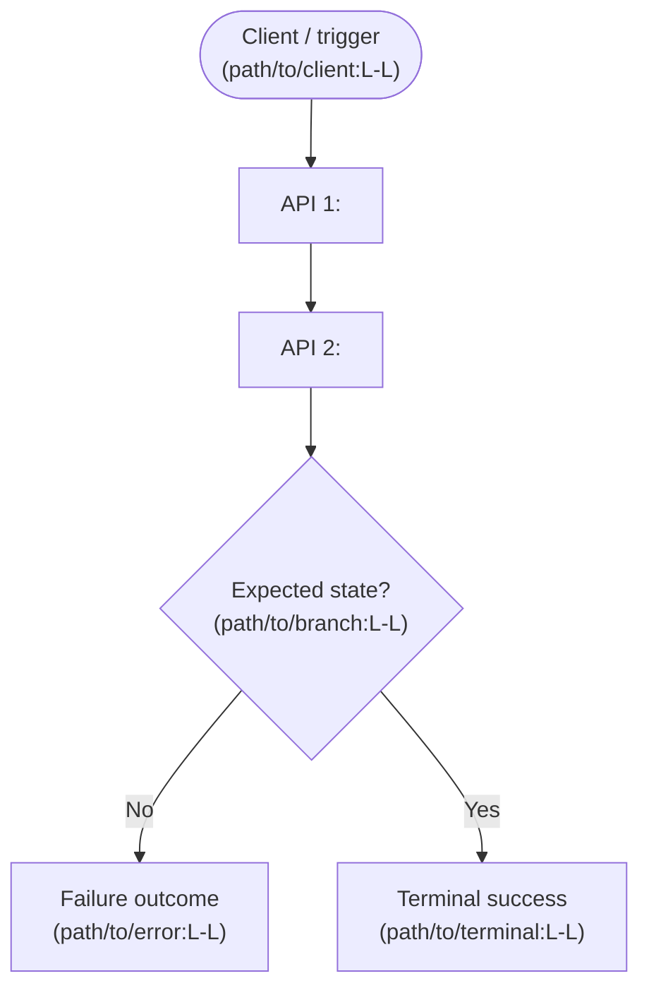
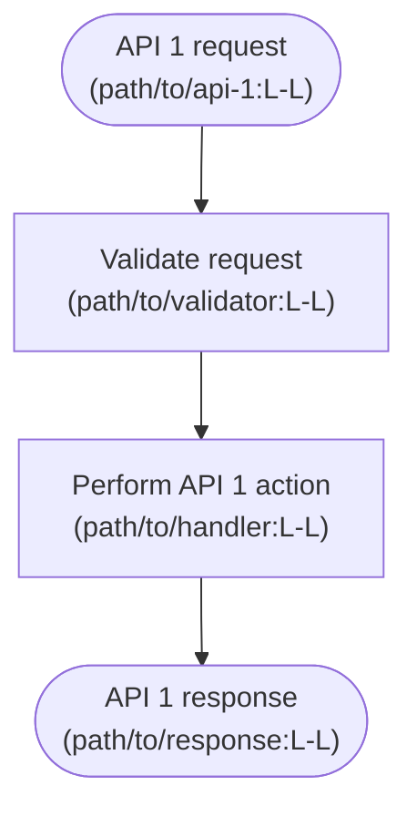

# Data Flow: <data-flow-name>

> Template-only: this file is not domain truth. Populate it only inside a
> User-authorized service workspace under `docs-harness/domain/<service-name>/`.
> Until then, keep its placeholders and do not index it as a domain resource.

This file is the visual E2E contract for one concrete service flow. Use Mermaid
`flowchart TD` activity diagrams and cite the source file and line range in
every execution node, branch, and state transition. Keep unknown details as
`TBD` or `Unverified`.

## Diagram Order Contract

1. The first Mermaid diagram below is the overall E2E flow, from the
   client/trigger through every relevant API to the terminal outcome.
2. Every later Mermaid diagram represents exactly one API listed in `apis.md`.
3. Keep the API order aligned with `apis.md`; do not combine multiple APIs in a
   later API diagram.

## 1. Overall E2E Flow

## 2. API 1 — `<method> <path>`

## 3. API 2 — `<method> <path>`

Add one numbered section and one Mermaid diagram like the examples above for
each additional API in `apis.md`. The overall diagram must remain section 1.

## Diagram-to-Source Index

| Diagram | API/flow step | Source file and line range | Observed behavior |
|---|---|---|---|
| Overall E2E | `<step>` | `<path>:L<start>-L<end>` | `<behavior>` |
| API 1 | `<step>` | `<path>:L<start>-L<end>` | `<behavior>` |

## Branches and Terminal Outcomes

- `<condition>`: `<branch behavior>` — evidence `<path>:L<start>-L<end>`
- Terminal success: `<observable result>` — evidence `<path>:L<start>-L<end>`
- Terminal failure: `<observable result>` — evidence `<path>:L<start>-L<end>`
