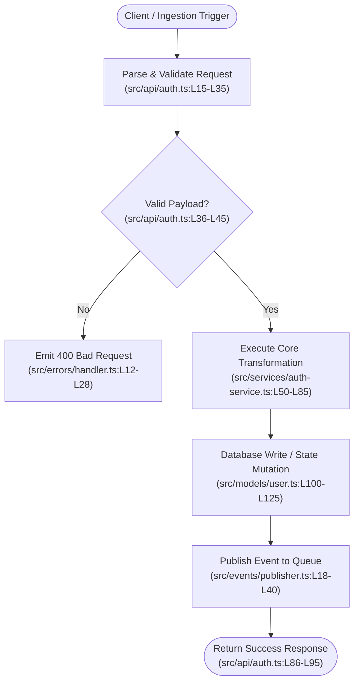

# Flow Activity Diagram: <Flow Name>

**Target Flow**: `<flow-name>`
**Primary Entry Point**: `<entry-point-file-and-function>`
**Terminal Exit Point**: `<exit-point-file-and-function>`

---

## 1. Visual Activity & Sequence Diagram (Mermaid)

> [!IMPORTANT]
> **Line Range Annotation Rule**:
> Every step, node, state transition, and conditional branch in the Mermaid diagram **MUST explicitly include the relative file path and code line ranges** in the node label.

---

## 2. Step-by-Step Code References

| Step | Component / Action | Exact Source File & Line Range | Observed Behavior |
| :--- | :--- | :--- | :--- |
| **1** | `<Action 1>` | `[path/to/file.ts:L10-L30](file:///path/to/file.ts#L10-L30)` | `<Description of behavior>` |
| **2** | `<Action 2>` | `[path/to/file.ts:L31-L55](file:///path/to/file.ts#L31-L55)` | `<Description of behavior>` |
| **3** | `<Action 3>` | `[path/to/file.ts:L56-L90](file:///path/to/file.ts#L56-L90)` | `<Description of behavior>` |

---

## 3. Branches & Error Paths

- **Condition 1 (`<Branch Name>`)**:
  - *Trigger Condition*: `<When condition occurs>`
  - *Code Reference*: `[path/to/file.ts:L40-L50](file:///path/to/file.ts#L40-L50)`
  - *Fallback / Error Mitigation*: `<How error is handled>`

- **Condition 2 (`<Branch Name>`)**:
  - *Trigger Condition*: `<When condition occurs>`
  - *Code Reference*: `[path/to/file.ts:L60-L75](file:///path/to/file.ts#L60-L75)`
  - *Fallback / Error Mitigation*: `<How error is handled>`
